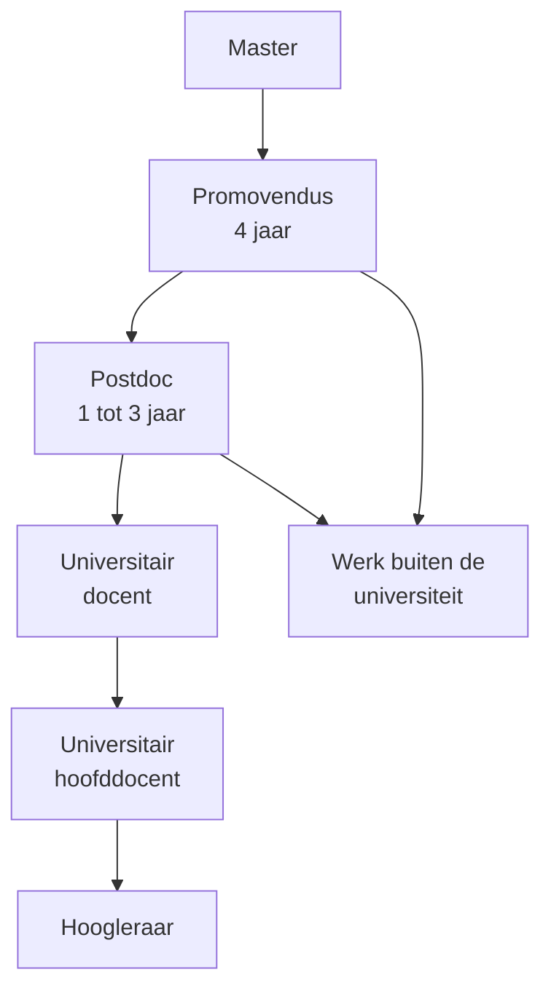

# De academische wereld

**Het verband in één zin:** achter elk wetenschappelijk artikel staan mensen op een [academische ladder](./academische-ladder.md) — van [promovendus](./promoveren.md) tot hoogleraar — en wie weet hoe die ladder werkt, kan een bron beter plaatsen.

Bij je [literatuurstudie](../literatuurstudie/van-zoeken-tot-lezen.mdx) kom je namen, functies en universiteiten tegen: "Jansen, promovendus aan de Radboud Universiteit", "prof. dr. De Vries, Universiteit Utrecht". Dit hoofdstuk legt uit wat daarachter zit. Handig bij het [beoordelen van een bron](../literatuurstudie/onderzoeker-onderzoeken.md), en ook als je zelf nadenkt over een studie.

## De ladder in één oogopslag

De meeste promovendi gaan na hun promotie buiten de universiteit aan het werk. De ladder naar hoogleraar is smal: per trede vallen er mensen af, of ze kiezen er zelf voor een andere kant op te gaan.

## Wat je in dit hoofdstuk vindt

| Pagina | Waar gaat het over? |
|---|---|
| [De academische ladder](./academische-ladder.md) | De functies aan een universiteit, wat er nodig is om hoger te komen, tenure track |
| [Promoveren](./promoveren.md) | Hoe je doctor wordt: promotor, proefschrift, stellingen, verdediging |
| [Universiteiten en AI](./universiteiten-en-ai.mdx) | Hoe je als student AI mag inzetten: de regels die overal gelden en de verschillen tussen negen universiteiten |

## Wat zegt de functie bij een artikel?

| Je leest… | Dat betekent… | Wat doe je ermee? |
|---|---|---|
| Eerste auteur is <B t="promovendus" tekst="promovendus"/> | Diegene heeft het onderzoek uitgevoerd, als onderdeel van een proefschrift | Neem het net zo serieus als ander werk met [peer review](../literatuurstudie/peer-review.md) |
| Laatste auteur is <B t="hoogleraar" tekst="hoogleraar"/> | Diegene leidt de groep en heeft het onderzoek begeleid | Kijk of het onderzoek past bij waar de groep bekend om staat |
| Bron is een <B t="proefschrift" tekst="proefschrift"/> | Een boek van jaren onderzoek, beoordeeld door een commissie | Gebruik de inleiding als overzicht en de literatuurlijst om verder te zoeken |
| Auteur is "emeritus" | Met pensioen, maar vaak nog actief | Check of het werk recent is en over jouw onderwerp gaat |

## Test jezelf

<Quiz
  vragen={[
    {
      vraag: 'Een onderzoeker heeft net haar master gehaald en is in dienst van de universiteit om in vier jaar een proefschrift te schrijven. Wat is haar functie?',
      opties: ['Student', 'Promovendus', 'Postdoc', 'Universitair docent'],
      juist: 1,
      uitleg: 'Een promovendus heeft al een master, krijgt salaris en doet zelfstandig onderzoek onder begeleiding. Een student is ze niet meer.',
    },
    {
      vraag: 'Iemand is gepromoveerd en werkt twee jaar in het onderzoeksproject van een hoogleraar, zonder eigen groep of vast contract. Wat is de functie?',
      opties: ['Promovendus', 'Postdoc', 'Universitair hoofddocent', 'Hoogleraar'],
      juist: 1,
      uitleg: 'Een postdoc is al doctor, maar werkt nog tijdelijk in het project van een ander om ervaring en publicaties op te bouwen.',
    },
    {
      vraag: 'Wie beslist er uiteindelijk of een proefschrift goed genoeg is?',
      opties: ['De promovendus zelf', 'De paranimfen', 'De promotor samen met de promotiecommissie', 'Het publiek bij de verdediging'],
      juist: 2,
      uitleg: 'De promotor moet tevreden zijn, en daarna keurt de commissie het manuscript goed. Bij de openbare verdediging is de beslissing in feite al gevallen.',
    },
    {
      vraag: 'Een universitair docent krijgt een contract van zes jaar met afspraken over publicaties, een beurs en onderwijs. Haalt ze die, dan krijgt ze een vast contract. Hoe heet zo’n constructie?',
      opties: ['Promotietraject', 'Tenure track', 'Peer review', 'Cum laude'],
      juist: 1,
      uitleg: 'Bij een tenure track werk je tijdelijk aan vooraf afgesproken doelen; haal je ze, dan volgt een vaste aanstelling (tenure).',
    },
    {
      vraag: 'Je vindt een artikel waarvan de laatste auteur een beroemde hoogleraar is. Wat zegt dat over wie de metingen heeft gedaan?',
      opties: ['De hoogleraar heeft alles zelf gemeten', 'Waarschijnlijk de eerste auteur, vaak een promovendus of postdoc', 'Niemand, het is een literatuuronderzoek', 'De paranimf'],
      juist: 1,
      uitleg: 'In de meeste vakgebieden staat wie het werk deed vooraan en wie het leidde achteraan. Zie de pagina over auteurvolgorde.',
    },
  ]}
/>

## Hangt samen met

- [Een onderzoeker onderzoeken](../literatuurstudie/onderzoeker-onderzoeken.md) — de functie van een auteur als eerste check
- [Auteurvolgorde](../literatuurstudie/auteurvolgorde.md) — waar je de treden van de ladder terugziet
- [Peer review](../literatuurstudie/peer-review.md) — de controle die elk artikel doorloopt, ongeacht wie het schreef
