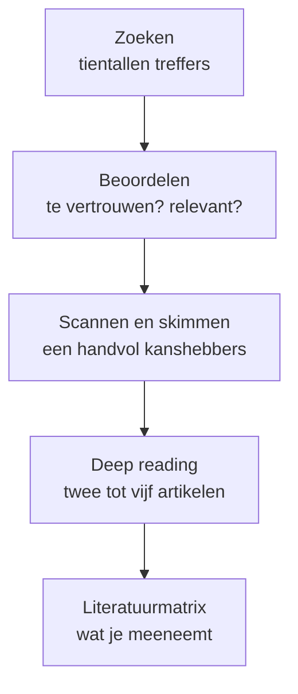

# Van zoeken tot lezen

**Het verband in één zin:** een literatuurstudie is een trechter — je **zoekt** breed, **beoordeelt** wat je vindt, en **leest** alleen grondig wat de trechter overleeft. Wie die volgorde omdraait en meteen het eerste artikel van voor naar achter leest, raakt zijn tijd kwijt aan de verkeerde bron.

<B t="literatuuronderzoek" tekst="Literatuuronderzoek"/> is bijna altijd de eerste deelvraag van je onderzoek: wat is er al bekend? Dat klinkt als "even googelen", maar wie dat letterlijk doet, verdrinkt. Op één zoekterm vind je duizenden wetenschappelijke artikelen. De kunst is niet om er méér te vinden, maar om snel te bepalen welke drie of vier de moeite waard zijn.

## De drie fasen

| Fase | Wat doe je? | Gereedschap | Tijd per bron |
|---|---|---|---|
| **Zoeken** | Treffers verzamelen met goede zoektermen en vanuit één goed artikel verder zoeken | [Zoektermen](./zoektermen.md), [Google Scholar](./google-scholar.md), [Semantic Scholar](./semantic-scholar.md), [sneeuwbalmethode](./sneeuwbalmethode.md) | Seconden |
| **Beoordelen** | Bepalen of een bron te vertrouwen is en wat zijn plek in het vakgebied is | [Peer review](./peer-review.md), [citaties](./citaties.md), [h-index](./h-index.md) | Een minuut |
| **Lezen** | Steeds dieper: eerst de samenvatting, dan de structuur, dan alles | [Abstract scannen](./abstract-scannen.md), [skimmen](./skimmen.md), [deep reading](./deep-reading.md), [literatuurmatrix](./literatuurmatrix.md) | 30 seconden tot 3 uur |

## Waarom de volgorde ertoe doet

Elke fase gooit bronnen weg, en dat is precies de bedoeling. Van vijftig treffers houd je er na het beoordelen misschien twintig over, na het scannen van de samenvattingen acht, na het skimmen drie. Die drie lees je grondig. Zo besteed je je uren aan de bronnen die het verdienen, en niet aan het artikel dat toevallig bovenaan stond.

Wie de trechter overslaat, herkent zich in een van deze twee:

- **De verzamelaar** downloadt veertig pdf's, leest er geen een af, en schrijft uiteindelijk zijn theoretisch kader op basis van twee samenvattingen.
- **De verdieper** leest het eerste artikel drie uur lang, ontdekt dan pas dat het over iets anders gaat, en heeft geen tijd meer om verder te zoeken.

:::tip[Vuistregel]
Lees pas grondig als je kunt uitleggen waaróm juist dit artikel. Kun je dat niet, dan zit je nog in de fase ervoor.
:::

## Wat je in dit hoofdstuk vindt

Het hoofdstuk volgt de trechter. Onder **Zoeken** leer je zoektermen maken en de twee grootste zoekmachines voor wetenschap gebruiken, plus de slimste manier om vanuit één goed artikel verder te komen. Onder **Beoordelen** leer je wat peer review, citaties en de h-index wél en niet zeggen. Onder **Lezen** staan de drie leesniveaus en het schema waarin je bijhoudt wat je vond. De afsluitende pagina [Welke strategie wanneer?](./welke-strategie.mdx) zet alles in één beslistabel.

## Hangt samen met

- [Literatuuronderzoek](../opzet/soorten/literatuuronderzoek.md) — de soort onderzoek waar dit hoofdstuk het gereedschap voor levert
- [Beschrijvend-definiërend](../opzet/functies/beschrijvend-definierend.md) — de functie die je bijna altijd met literatuur beantwoordt
- [Transparant](../spelregels/transparant.md) — waarom je alles wat je vindt met bron vastlegt
