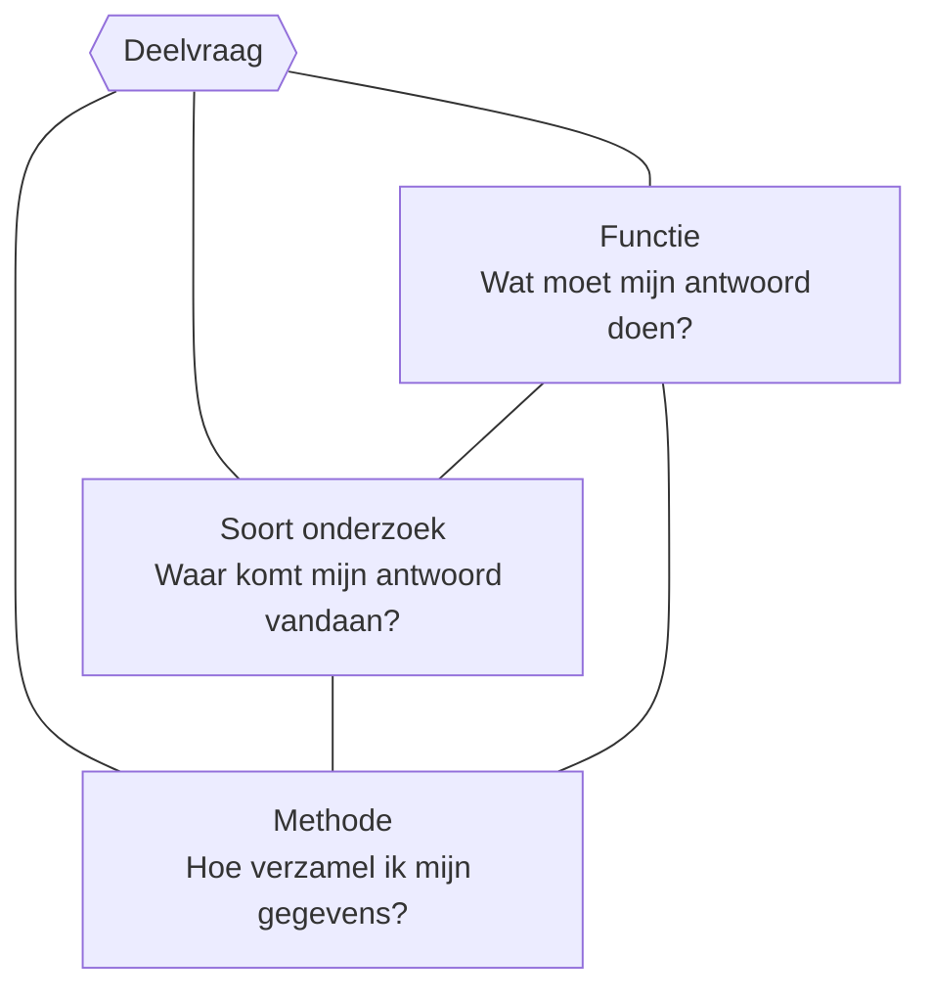

import Quiz from '@site/src/components/Quiz';

# De keuzedriehoek

**Het verband in één zin:** bij het opzetten van onderzoek maak je per deelvraag drie keuzes — de [functie](./functies/functies-overzicht.mdx) (wat moet mijn antwoord doen?), het [soort onderzoek](./soorten/soorten-combineren.mdx) (waar komt mijn antwoord vandaan?) en de [methode van gegevensverzameling](./methoden/methode-kiezen.mdx) (hoe verzamel ik mijn gegevens?) — en die drie moeten bij elkaar passen.

De regel: **je maakt de drie keuzes niet één keer voor je hele onderzoek, maar per deelvraag.** Elke deelvraag krijgt zo zijn eigen driehoek.

## Zo gebruik je de driehoek

Loop voor **elke deelvraag** deze drie stappen langs:

1. **Bepaal de [functie](./functies/functies-overzicht.mdx).** Moet het antwoord iets beschrijven (hoe is het?), vergelijken, definiëren, evalueren — of verklaren (waarom is het zo?)? De vorm van de vraag verraadt de functie.
2. **Kies het [soort onderzoek](./soorten/soorten-combineren.mdx).** Staat het antwoord al ergens ([literatuuronderzoek](./soorten/literatuuronderzoek.md))? Moet je de echte situatie in ([veldonderzoek](./soorten/veldonderzoek.md))? Of moet je zelf iets veranderen om een effect te meten ([experimenteel](./soorten/experimenteel.md))?
3. **Kies de [methode](./methoden/methode-kiezen.mdx).** Wil je gedrag zien ([observatie](./methoden/observatie.md)), meningen horen ([interview](./methoden/interview.md) of [enquête](./methoden/enquete.md)) of bestaand materiaal bestuderen ([analyse](./methoden/analyse-materiaal.md))? Bedenk ook of je [cijfers of woorden](../gegevens/kwal-vs-kwant.mdx) nodig hebt.

Controleer daarna of de drie keuzes **bij elkaar passen**. Een [toetsende functie](./functies/verklarend-toetsend.md) met alleen een paar interviews wringt bijvoorbeeld: voor het toetsen van een verklaring heb je een gerichte meting of een experiment nodig. Wringt het? Pas je keuze aan — of formuleer je deelvraag scherper.

## Veelvoorkomende combinaties

| Functie | Soort onderzoek | Methode |
|---|---|---|
| [Definiërend](./functies/beschrijvend-definierend.md) | Literatuuronderzoek | Analyse van teksten |
| [Puur beschrijvend](./functies/puur-beschrijvend.md) | Veldonderzoek | Observatie of enquête |
| [Vergelijkend](./functies/beschrijvend-vergelijkend.md) | Veldonderzoek | Dezelfde enquête of observatie bij twee groepen |
| [Evaluerend](./functies/beschrijvend-evaluerend.md) | Veldonderzoek | Testen met gebruikers tegen vooraf opgestelde eisen |
| [Explorerend](./functies/verklarend-explorerend.md) | Veldonderzoek | Interviews, open vragen |
| [Toetsend](./functies/verklarend-toetsend.md) | Experimenteel onderzoek | Meting onder gecontroleerde omstandigheden |

Dit zijn géén verplichte recepten — een evaluerende deelvraag kan bijvoorbeeld ook via analyse van materiaal — maar als jouw driehoek er heel anders uitziet, is dat een goed moment om even te controleren of hij klopt.

## Uitgewerkt voorbeeld

**Hoofdvraag:** *Hoe kan ik een plan van aanpak ontwerpen waarmee meer leerlingen bij ons op school met de fiets komen?* (een [ontwerpvraag](../typen/ontwerpgericht.md) — het eindproduct is een plan dat aan vooraf opgestelde eisen moet voldoen)

| Deelvraag | Functie | Soort onderzoek | Methode |
|---|---|---|---|
| 1. Wat verstaan we onder "actief vervoer" en wat is er bekend over fietsgedrag van jongeren? | Definiërend | Literatuuronderzoek | Analyse van teksten |
| 2. Hoeveel leerlingen komen nu met de fiets, en verschilt dat per afstand tot school? | Puur beschrijvend + vergelijkend | Veldonderzoek | Observatie (telling bij de ingang) + korte enquête |
| 3. Waarom kiezen leerlingen die dichtbij wonen tóch niet voor de fiets? | Verklarend-explorerend | Veldonderzoek | Interviews |
| 4. Zorgt een beloningsactie van twee weken voor meer fietsers? | Verklarend-toetsend | Experimenteel onderzoek | Telling vóór, tijdens en na de actie |
| 5. Voldoet ons uiteindelijke plan aan de eisen van leerlingen en schoolleiding? | Evaluerend | Veldonderzoek | Enquête onder leerlingen + interview met schoolleiding |

Vijf deelvragen, vijf driehoeken — en samen beantwoorden ze stap voor stap de hoofdvraag. Let op hoe de functies logisch opbouwen: eerst definiëren en beschrijven, dan verklaren, en tot slot evalueren.

## Oefenen: vul de driehoek in

Kies bij elke deelvraag de driehoek (functie · soort · methode) die het best past. Hoofdvraag: *Hoe kan de mediatheek een fijnere studeerplek worden?*

<Quiz
  vragen={[
    {
      vraag: 'Wat maakt een studeerplek volgens bestaand onderzoek prettig om te werken?',
      opties: [
        'Definiërend · literatuuronderzoek · analyse van teksten',
        'Puur beschrijvend · veldonderzoek · observatie',
        'Explorerend · veldonderzoek · interviews',
      ],
      juist: 0,
      uitleg: 'Je bakent af wat "prettig studeren" inhoudt met bestaande bronnen — "volgens bestaand onderzoek" verraadt het literatuuronderzoek.',
    },
    {
      vraag: 'Hoe wordt de mediatheek nu gebruikt: wanneer is het druk, en wat doen leerlingen er?',
      opties: [
        'Definiërend · literatuuronderzoek · analyse van teksten',
        'Puur beschrijvend · veldonderzoek · observatie',
        'Toetsend · experimenteel onderzoek · meting',
      ],
      juist: 1,
      uitleg: 'Gebruik en drukte zie je door te kijken: observeren met een observatieschema, op meerdere momenten.',
    },
    {
      vraag: 'Waarom studeren sommige leerlingen liever thuis dan in de mediatheek?',
      opties: [
        'Puur beschrijvend · veldonderzoek · enquête',
        'Toetsend · experimenteel onderzoek · meting',
        'Explorerend · veldonderzoek · interviews',
      ],
      juist: 2,
      uitleg: 'Je zoekt open naar verklaringen bij de mensen zelf — "waarom" zonder verwachting vooraf is explorerend, en dat vraagt om doorvragen in interviews.',
    },
    {
      vraag: 'Wordt er stiller gewerkt als de tafels in een andere opstelling staan?',
      opties: [
        'Explorerend · veldonderzoek · interviews',
        'Toetsend · experimenteel onderzoek · observatie/meting',
        'Definiërend · literatuuronderzoek · analyse van teksten',
      ],
      juist: 1,
      uitleg: 'Je verandert zelf één ding (de opstelling) en meet het effect, bijvoorbeeld met een geluidsmeting vóór en na — een toetsend experiment.',
    },
  ]}
/>
