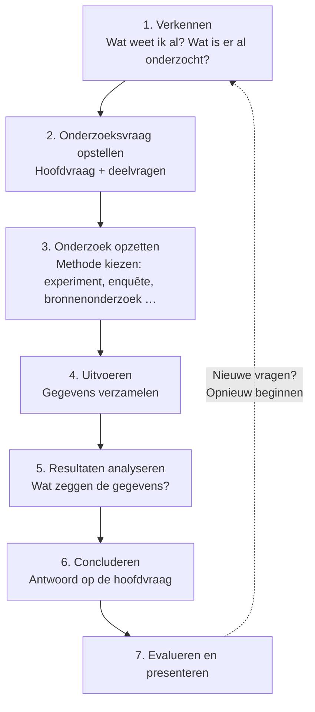
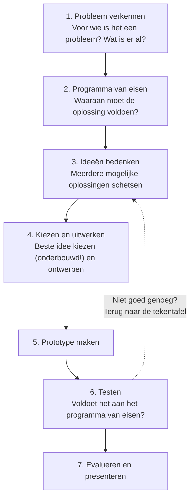

# Theoriegericht vs. ontwerpgericht onderzoek

Voordat je aan een onderzoek begint, moet je één belangrijke vraag beantwoorden: **wil ik iets te weten komen, of wil ik iets maken?**

- Wil je iets **te weten komen**? Dan doe je **theoriegericht onderzoek**.
- Wil je iets **maken** dat een probleem oplost? Dan doe je **ontwerpgericht onderzoek**.

Dit verschil klinkt simpel, maar het bepaalt bijna alles: hoe je hoofdvraag eruitziet, welke stappen je zet en wat je aan het einde oplevert.

## Theoriegericht onderzoek: "Hoe zit het?"

Bij theoriegericht onderzoek wil je **kennis** opdoen. Je stelt een vraag over hoe iets in elkaar zit, waarom iets gebeurt of wat het effect van iets is. Het antwoord is aan het einde van je onderzoek een **conclusie**: een onderbouwd antwoord op je hoofdvraag.

**Voorbeelden van theoriegerichte hoofdvragen:**

- *Welke invloed heeft slaaptekort op de concentratie van scholieren?*
- *Waarom is de ene wachtwoordkraak-methode sneller dan de andere?*
- *In hoeverre verschilt het energieverbruik van een elektrische fiets van dat van een brommer?*
- *Hoe beïnvloedt de hoeveelheid licht de groei van tuinkers?*

Herken je het patroon? De vragen beginnen vaak met **hoe, waarom, welke invloed, in hoeverre**. Het zijn **kennisvragen**: je wilt de wereld beter begrijpen.

### De onderzoekscyclus

Theoriegericht onderzoek volgt meestal de **onderzoekscyclus**:

Je eindproduct is een **antwoord**: een conclusie die je kunt onderbouwen met de gegevens die je hebt verzameld.

:::tip Goed om te weten
Een conclusie als *"mijn hypothese klopt niet"* is óók een geldig resultaat! Bij theoriegericht onderzoek gaat het erom dat je **eerlijk** antwoord geeft op je vraag, niet dat de uitkomst is wat je hoopte.
:::

## Ontwerpgericht onderzoek: "Hoe maak ik iets dat…?"

Bij ontwerpgericht onderzoek wil je een **product** maken dat een probleem oplost. Dat product kan van alles zijn: een app, een website, een machine, een lesprogramma, een spel of een prototype. Het antwoord op je hoofdvraag is aan het einde geen conclusie, maar een **werkend ontwerp**.

**Voorbeelden van ontwerpgerichte hoofdvragen:**

- *Hoe kan ik een app ontwerpen die scholieren helpt minder tijd op hun telefoon door te brengen?*
- *Hoe ontwerp ik een fietsenstalling waarin twee keer zoveel fietsen passen?*
- *Hoe maak ik een website waarop brugklassers snel hun weg vinden?*
- *Hoe ontwikkel ik een spel dat groep 8 leert omgaan met nepnieuws?*

Deze vragen beginnen bijna altijd met **"Hoe kan ik … ontwerpen/maken/ontwikkelen …"** gevolgd door een doel: **"… dat/die/waarmee …"**. Het zijn **ontwerpvragen**.

### Het programma van eisen

Hoe weet je of je ontwerp geslaagd is? Daarvoor stel je vóórdat je gaat ontwerpen een **programma van eisen (PvE)** op: een lijst met eisen en wensen waaraan je product moet voldoen.

Bijvoorbeeld voor de telefoon-app hierboven:

1. De app laat zien hoeveel tijd je vandaag op je telefoon zat.
2. De app stuurt maximaal twee meldingen per dag.
3. De app is te gebruiken door leerlingen van 12 t/m 18 jaar zonder uitleg.
4. De app werkt op Android én iOS.

Aan het einde van je onderzoek **test** je je ontwerp tegen deze eisen. Zo maak je van "iets maken" echt **onderzoek**: je toont met tests aan of je oplossing werkt.

### De ontwerpcyclus

Ontwerpgericht onderzoek volgt de **ontwerpcyclus**:

Je eindproduct is een **ontwerp of prototype**, plus een verslag waarin je laat zien dat (en hoe goed) het aan je eisen voldoet.

:::caution Let op
Alleen iets maken is nog geen onderzoek. Het verschil zit in het **testen tegen je programma van eisen** en het **onderbouwen van je keuzes**. Zonder eisen en tests heb je een knutselproject, geen ontwerponderzoek.
:::

## De twee typen naast elkaar

| | **Theoriegericht** | **Ontwerpgericht** |
|---|---|---|
| **Doel** | Iets te weten komen | Een probleem oplossen met een product |
| **Soort hoofdvraag** | Kennisvraag: *"Hoe zit het…?", "Welke invloed…?", "In hoeverre…?"* | Ontwerpvraag: *"Hoe kan ik … maken dat …?"* |
| **Werkwijze** | Onderzoekscyclus | Ontwerpcyclus |
| **Meetlat** | Hypothese en deelvragen | Programma van eisen |
| **Eindresultaat** | Onderbouwde conclusie | Werkend ontwerp of prototype + testresultaten |
| **Geslaagd als…** | Je vraag eerlijk en onderbouwd beantwoord is (ook als de uitkomst anders is dan verwacht) | Je product (grotendeels) aan het programma van eisen voldoet en je je keuzes kunt onderbouwen |
| **Voorbeeld** | *Welke wachtwoorden worden het snelst gekraakt?* | *Hoe maak ik een tool die zwakke wachtwoorden herkent?* |

## Ze hebben elkaar nodig

In de praktijk staan de twee typen niet los van elkaar:

- **In elk ontwerponderzoek zit theoriegericht onderzoek verstopt.** Voordat je die telefoon-app ontwerpt, moet je eerst uitzoeken: *waarom* zitten scholieren zoveel op hun telefoon, en wat werkt volgens bestaand onderzoek om dat te verminderen? Dat vooronderzoek is theoriegericht.
- **Theoriegericht onderzoek leidt vaak tot nieuwe ontwerpen.** Als uit onderzoek blijkt dat meldingen de grootste afleider zijn, is dát het aanknopingspunt voor een ontwerp.

:::tip Voor je profielwerkstuk of praktische opdracht
Kies bewust. Vind je het leuk om iets te bouwen? Formuleer dan een ontwerpvraag — maar plan ook tijd in voor het vooronderzoek en het testen. Wil je liever uitzoeken en meten? Kies dan een kennisvraag en maak die zo concreet mogelijk.
:::

## Oefenen: welk type is het?

Bepaal van elke hoofdvraag of die **theoriegericht (T)** of **ontwerpgericht (O)** is:

1. *In hoeverre beïnvloedt muziek tijdens het huiswerk maken de leerprestaties?*
2. *Hoe kan ik een chatbot maken die vragen van brugklassers over het rooster beantwoordt?*
3. *Welke factoren bepalen of een video op sociale media viraal gaat?*
4. *Hoe ontwerp ik een schoolplein waar leerlingen meer bewegen?*
5. *Waarom gebruiken jongeren steeds vaker een adblocker?*
6. *Hoe ontwikkel ik een escaperoom die groep 7 leert over duurzaamheid?*

Bekijk de antwoorden

1. **T** — je meet een effect, je maakt niets.
2. **O** — je maakt een product (chatbot) voor een doelgroep.
3. **T** — je zoekt uit hoe iets werkt.
4. **O** — je ontwerpt iets (een schoolplein) dat een doel moet bereiken.
5. **T** — je zoekt een verklaring.
6. **O** — je ontwikkelt een product met een doel; het vooronderzoek (wat weet groep 7 al over duurzaamheid?) is theoriegericht.

## Samengevat

- **Theoriegericht onderzoek** beantwoordt een **kennisvraag** via de **onderzoekscyclus**; het resultaat is een **conclusie**.
- **Ontwerpgericht onderzoek** beantwoordt een **ontwerpvraag** via de **ontwerpcyclus**; het resultaat is een **ontwerp** dat je toetst aan een **programma van eisen**.
- De twee vullen elkaar aan: goed ontwerpen begint met kennis, en nieuwe kennis leidt tot betere ontwerpen.
