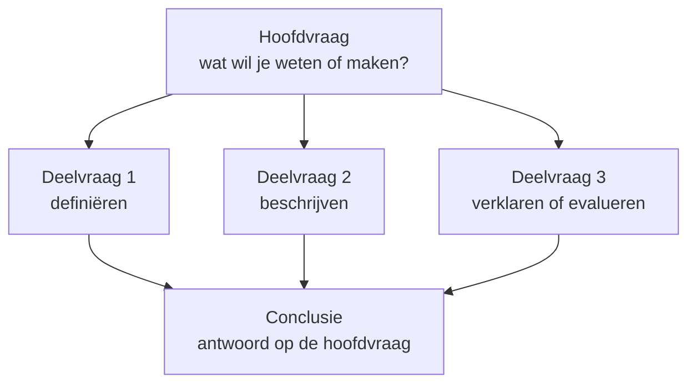

# Hoofd- en deelvragen samen

**Het verband in één zin:** de <B t="hoofdvraag" tekst="hoofdvraag"/> zegt wát je wilt weten of maken, de <B t="deelvraag" tekst="deelvragen"/> zeggen in welke stappen je daar komt — en de antwoorden op de deelvragen moeten samen precies het antwoord op de hoofdvraag opleveren.

## Naast elkaar

| | [**Hoofdvraag**](./hoofdvraag.md) | [**Deelvragen**](./deelvragen.md) |
|---|---|---|
| **Hoeveel?** | Eén | Meestal drie tot zes |
| **Wat doet hij?** | Zegt wat je hele onderzoek wil weten of maken | Deelt dat op in stappen die je los kunt beantwoorden |
| **Welke keuze hoort erbij?** | Het [type](../typen/theorie-vs-ontwerp.mdx): kennisvraag of ontwerpvraag | Per deelvraag een [driehoek](../opzet/keuzedriehoek.mdx): functie, soort onderzoek, methode |
| **Waar komt het antwoord?** | In je conclusie | In je resultaten, per deelvraag |
| **Typische fout** | Te breed, gesloten of sturend | Herhaalt de hoofdvraag, of gaat een zijstraat in |
| **Wat komt erbij?** | Een aanleiding en een afbakening | Bij vergelijkende en toetsende deelvragen een [hypothese](./hypothese.md); bij alles wat je meet een [operationalisatie](./operationaliseren.md) |

## Twee uitgewerkte voorbeelden

**Theoriegericht.** *In hoeverre hangt de slaapduur van 4-havoleerlingen op onze school samen met hun concentratie in het eerste lesuur?*

| Deelvraag | Functie |
|---|---|
| 1. Wat verstaan we onder concentratie, en hoe kun je die in een klas meten? | [Definiërend](../opzet/functies/beschrijvend-definierend.md) |
| 2. Hoe lang slapen 4-havoleerlingen op doordeweekse nachten? | [Puur beschrijvend](../opzet/functies/puur-beschrijvend.md) |
| 3. Hoe goed concentreren zij zich in het eerste lesuur? | [Puur beschrijvend](../opzet/functies/puur-beschrijvend.md) |
| 4. Verschilt de concentratie tussen leerlingen die kort en die lang slapen? | [Vergelijkend](../opzet/functies/beschrijvend-vergelijkend.md) |

Zet je de antwoorden naast elkaar, dan heb je je conclusie. Let wel op het woord *samenhang* in de hoofdvraag: dat twee dingen samen voorkomen, bewijst nog niet dat het een het ander veroorzaakt. Zie [interne validiteit](../spelregels/interne-validiteit.md).

Twee dingen maken deze deelvragen klaar voor de uitvoering. Bij deelvraag 4 hoort een [hypothese](./hypothese.md): *ik verwacht dat leerlingen die korter dan zeven uur slapen zich slechter concentreren, omdat eerder onderzoek laat zien dat slaaptekort de aandacht vermindert.* En deelvraag 1 is het begin van [operationaliseren](./operationaliseren.md): pas als je weet hoe je concentratie meet, kun je deelvraag 3 en 4 beantwoorden.

**Ontwerpgericht.** *Hoe kan ik een planningsapp ontwerpen waarmee 4-havoleerlingen hun huiswerk beter over de week verdelen?*

| Deelvraag | Functie |
|---|---|
| 1. Hoe plannen 4-havoleerlingen nu hun huiswerk, en waar loopt het mis? | [Explorerend](../opzet/functies/verklarend-explorerend.md) |
| 2. Welke planningsapps bestaan er al, en hoe goed passen die bij 4-havoleerlingen? | [Evaluerend](../opzet/functies/beschrijvend-evaluerend.md) |
| 3. Aan welke eisen moet mijn app voldoen volgens leerlingen en mentoren? | [Definiërend](../opzet/functies/beschrijvend-definierend.md) — je legt vast wat "goed" is |
| 4. In hoeverre voldoet mijn prototype aan die eisen? | [Evaluerend](../opzet/functies/beschrijvend-evaluerend.md) |

Hier volgt de conclusie niet uit het naast elkaar zetten, maar uit deelvraag 4: het antwoord op de hoofdvraag is je ontwerp, getoetst aan de eisen uit deelvraag 3.

## De controle: werken je deelvragen?

Leg je lijstje naast deze vier vragen:

1. **Als ik alle deelvragen beantwoord, weet ik dan het antwoord op mijn hoofdvraag?** Zo niet: welke stap mist er?
2. **Draagt elke deelvraag iets bij?** Kun je er een schrappen zonder dat het antwoord op de hoofdvraag wankelt, dan is het een zijstraat.
3. **Herhaalt geen enkele deelvraag de hoofdvraag?** Dan heb je die niet opgedeeld, alleen gekopieerd.
4. **Staan ze in een logische volgorde?** Meestal eerst definiëren, dan beschrijven, dan verklaren of evalueren.

## Oefenen: wat is er mis met deze hoofdvraag?

<Quiz
  vragen={[
    {
      vraag: 'Heeft muziek invloed op de concentratie?',
      opties: ['Gesloten', 'Te breed', 'Sturend', 'Twee vragen in één', 'Niet onderzoekbaar'],
      juist: 0,
      uitleg: 'Het antwoord is ja of nee, en daarna ben je klaar. Open wordt het met "In hoeverre…" of "Welke invloed…".',
    },
    {
      vraag: 'Hoe gebruiken jongeren sociale media?',
      opties: ['Gesloten', 'Te breed', 'Sturend', 'Twee vragen in één', 'Niet onderzoekbaar'],
      juist: 1,
      uitleg: 'Welke jongeren, welke media, welk gebruik? Baken af: wie, wat, waar, wanneer.',
    },
    {
      vraag: 'Waarom is de nieuwe kantine een verbetering voor leerlingen?',
      opties: ['Gesloten', 'Te breed', 'Sturend', 'Twee vragen in één', 'Niet onderzoekbaar'],
      juist: 2,
      uitleg: 'Het antwoord zit al in de vraag: dat het een verbetering is, moet je juist onderzoeken.',
    },
    {
      vraag: 'Hoeveel leerlingen fietsen naar school en wat vinden docenten van het rooster?',
      opties: ['Gesloten', 'Te breed', 'Sturend', 'Twee vragen in één', 'Niet onderzoekbaar'],
      juist: 3,
      uitleg: 'Twee losse onderwerpen aan elkaar geplakt. Een hoofdvraag gaat over één ding.',
    },
    {
      vraag: 'Wat is het effect van tien jaar schermtijd op de hersenontwikkeling van kinderen?',
      opties: ['Gesloten', 'Te breed', 'Sturend', 'Twee vragen in één', 'Niet onderzoekbaar'],
      juist: 4,
      uitleg: 'Een goede vraag, maar niet voor jou: daarvoor heb je tien jaar en hersenscans nodig. Kies iets wat je met jouw middelen en in jouw tijd kunt meten.',
    },
  ]}
/>

## Oefenen: hoort deze deelvraag erbij?

Hoofdvraag: *In hoeverre hangt de slaapduur van 4-havoleerlingen samen met hun concentratie in het eerste lesuur?*

<Quiz
  vragen={[
    {
      vraag: 'Hoe lang slapen 4-havoleerlingen op doordeweekse nachten?',
      opties: ['Goede deelvraag', 'Herhaalt de hoofdvraag', 'Zijstraat'],
      juist: 0,
      uitleg: 'Een noodzakelijke stap: zonder slaapduur geen samenhang.',
    },
    {
      vraag: 'Hangt de slaapduur van 4-havoleerlingen samen met hun concentratie?',
      opties: ['Goede deelvraag', 'Herhaalt de hoofdvraag', 'Zijstraat'],
      juist: 1,
      uitleg: 'Dit is de hoofdvraag in andere woorden. Een deelvraag is een stap ernaartoe, geen kopie.',
    },
    {
      vraag: 'Hoeveel uur slapen hun ouders?',
      opties: ['Goede deelvraag', 'Herhaalt de hoofdvraag', 'Zijstraat'],
      juist: 2,
      uitleg: 'Misschien interessant, maar het antwoord helpt je niet bij de hoofdvraag.',
    },
    {
      vraag: 'Hoe kun je concentratie in een klaslokaal meten?',
      opties: ['Goede deelvraag', 'Herhaalt de hoofdvraag', 'Zijstraat'],
      juist: 0,
      uitleg: 'Een definiërende deelvraag: je moet weten wat je meet voordat je kunt meten.',
    },
    {
      vraag: 'Hoe laat gingen scholieren honderd jaar geleden naar bed?',
      opties: ['Goede deelvraag', 'Herhaalt de hoofdvraag', 'Zijstraat'],
      juist: 2,
      uitleg: 'Leuk weetje, geen bouwsteen: de hoofdvraag gaat over 4-havoleerlingen nu.',
    },
  ]}
/>

## Oefenen: wat is er mis met deze hypothese?

<Quiz
  vragen={[
    {
      vraag: 'Slaap is belangrijk voor scholieren.',
      opties: ['Niet toetsbaar', 'Geen richting', 'Kan niet sneuvelen', 'Niet onderbouwd', 'Goede hypothese'],
      juist: 0,
      uitleg: 'Wat zou je moeten meten om dit te weerleggen? "Belangrijk" is een oordeel, geen meetbare uitkomst.',
    },
    {
      vraag: 'Slaapduur en concentratie hangen met elkaar samen.',
      opties: ['Niet toetsbaar', 'Geen richting', 'Kan niet sneuvelen', 'Niet onderbouwd', 'Goede hypothese'],
      juist: 1,
      uitleg: 'Welke kant op? Zeg wat je verwacht: wie korter slaapt, concentreert zich slechter.',
    },
    {
      vraag: 'Misschien concentreren leerlingen die kort slapen zich soms slechter.',
      opties: ['Niet toetsbaar', 'Geen richting', 'Kan niet sneuvelen', 'Niet onderbouwd', 'Goede hypothese'],
      juist: 2,
      uitleg: 'Met "misschien" en "soms" klopt hij altijd, wat er ook uitkomt — en zegt hij dus niets.',
    },
    {
      vraag: 'Ik verwacht dat leerlingen met een rode fiets beter presteren, omdat ik dat een leuk idee vind.',
      opties: ['Niet toetsbaar', 'Geen richting', 'Kan niet sneuvelen', 'Niet onderbouwd', 'Goede hypothese'],
      juist: 3,
      uitleg: 'Toetsbaar en met richting, maar het "omdat" komt niet uit bronnen of vooronderzoek.',
    },
    {
      vraag: 'Ik verwacht dat leerlingen die korter dan zeven uur slapen meer fouten maken op een aandachtstaak, omdat eerder onderzoek laat zien dat slaaptekort de aandacht vermindert.',
      opties: ['Niet toetsbaar', 'Geen richting', 'Kan niet sneuvelen', 'Niet onderbouwd', 'Goede hypothese'],
      juist: 4,
      uitleg: 'Toetsbaar, met richting, kan sneuvelen (als er geen verschil is) en onderbouwd met vooronderzoek.',
    },
  ]}
/>

## Aan de slag

Snel aan de slag? In de werkvorm [Vragenkaartjes](../werkvormen/vragenkaartjes.mdx) schrijf je je hoofdvraag en deelvragen op kaartjes en toets je ze in een half lesuur. Uitgebreider is [Scherp je vraag](../werkvormen/scherp-je-vraag.mdx): daar maak je van je eigen onderwerp een hoofdvraag, laat je die beoordelen door een klasgenoot, en werk je hem uit tot deelvragen, hypothesen en een operationalisatie.

## Hangt samen met

- [Theoriegericht vs. ontwerpgericht](../typen/theorie-vs-ontwerp.mdx) — de keuze die bepaalt wat voor hoofdvraag je stelt
- [De keuzedriehoek](../opzet/keuzedriehoek.mdx) — wat je per deelvraag kiest
- [Functies van onderzoek](../opzet/functies/functies-overzicht.mdx) — waaraan je ziet wat een deelvraag moet doen
